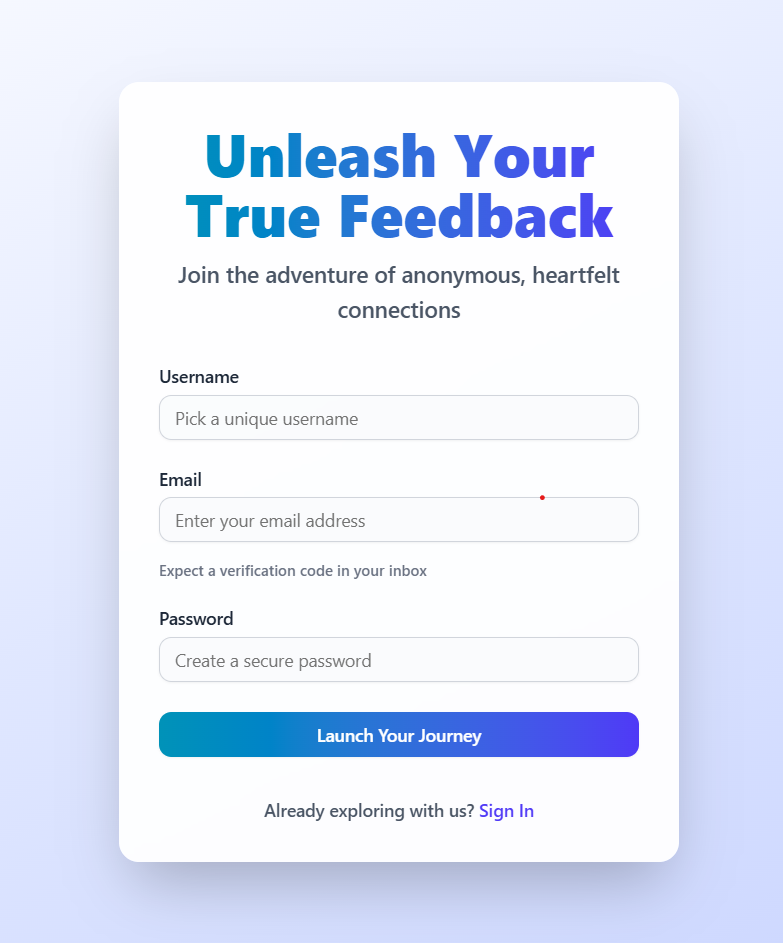
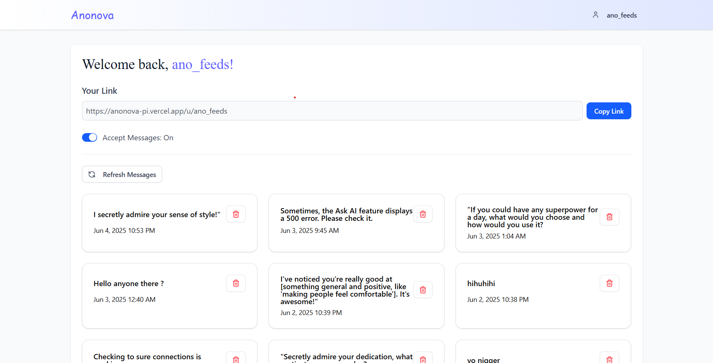
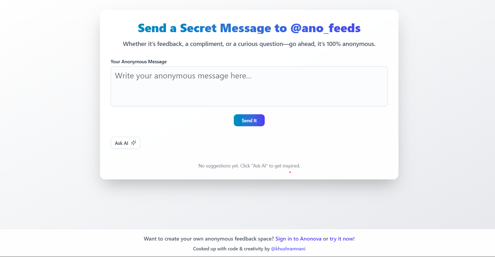

# 🎭 Anonova - Anonymous Messaging Platform

Anonova is a modern, secure anonymous messaging platform that enables users to receive honest feedback, compliments, and messages from friends, colleagues, or strangers without revealing the sender's identity.

## 🌟 Live Demo

🔗 **[Visit Anonova Live](https://anonova-pi.vercel.app/)**

## 📸 Screenshots

### Sign Up Page


### User Dashboard


### Anonymous Messaging Interface


## ✨ Features

### 🔐 Core Functionality
- **Anonymous Messaging**: Send and receive completely anonymous messages
- **Unique User Links**: Each user gets a shareable link (e.g., `anonova.app/u/username`)
- **Message Management**: View, organize, and delete received messages
- **Privacy Controls**: Toggle message acceptance on/off anytime
- **Real-time Updates**: Live dashboard updates for new messages

### 🤖 AI-Powered Experience
- **Smart Message Suggestions**: AI-generated conversation starters using Google Gemini
- **Content Moderation**: Safe and appropriate message suggestions
- **Engaging Prompts**: Creative, fun, and thought-provoking message ideas

### 🛡️ Security & Authentication
- **Secure Account Creation**: Email verification with OTP
- **Password Protection**: Bcrypt-hashed passwords
- **Session Management**: NextAuth.js for secure authentication
- **Username Validation**: Real-time username availability checking

### 💌 Communication
- **Email Notifications**: Verification codes and updates via Nodemailer
- **Responsive Design**: Works seamlessly on all devices
- **Modern UI**: Clean, intuitive interface with smooth animations

## 🚀 Tech Stack

### Frontend
- **[Next.js 15](https://nextjs.org)** - React framework with App Router
- **[React 19](https://react.dev)** - UI library
- **[TypeScript](https://www.typescriptlang.org)** - Type safety
- **[Tailwind CSS](https://tailwindcss.com)** - Styling
- **[Framer Motion](https://www.framer.com/motion)** - Animations


### Backend
- **[MongoDB](https://mongodb.com)** - Database
- **[Mongoose](https://mongoosejs.com)** - ODM
- **[NextAuth.js](https://next-auth.js.org)** - Authentication
- **[Zod](https://zod.dev)** - Schema validation

### AI & Communication
- **[Google Generative AI](https://ai.google.dev)** - Message suggestions
- **[Nodemailer](https://nodemailer.com)** - Email service
- **[Resend](https://resend.com)** - Email API (backup)

### Deployment & Analytics
- **[Vercel](https://vercel.com)** - Hosting platform
- **[Vercel Analytics](https://vercel.com/analytics)** - Usage analytics

## 🏃‍♂️ Getting Started

### Prerequisites
- Node.js 18+ and npm/yarn/pnpm
- MongoDB database (local or cloud)
- Environment variables setup

### Installation

1. **Clone the repository**
```bash
git clone https://github.com/khushramnani/anonova.git
cd anonova
```

2. **Install dependencies**
```bash
npm install
# or
yarn install
# or
pnpm install
```

3. **Environment Setup**
Create a `.env.local` file in the root directory:
```env
# Database
MONGODB_URI=your_mongodb_connection_string

# Authentication
NEXTAUTH_SECRET=your_nextauth_secret
NEXTAUTH_URL=http://localhost:3000

# AI
GEMINI_API_KEY=your_google_gemini_api_key

# Email
EMAIL_USER=your_email@gmail.com
EMAIL_PASS=your_email_app_password

# Optional: Resend API
RESEND_API_KEY=your_resend_api_key
```

4. **Run the development server**
```bash
npm run dev
# or
yarn dev
# or
pnpm dev
```

5. **Open your browser**
Navigate to [http://localhost:3000](http://localhost:3000) to see the application.

## 📁 Project Structure

```
src/
├── app/
│   ├── (app)/dashboard/          # User dashboard
│   ├── (auth)/                   # Authentication pages
│   ├── api/                      # API routes
│   ├── u/[username]/             # Public user profiles
│   └── page.tsx                  # Homepage
├── components/
│   ├── custom/                   # Custom components
│   └── ui/                       # Reusable UI components
├── lib/                          # Utility functions
├── models/                       # Database models
├── schemas/                      # Zod validation schemas
└── types/                        # TypeScript type definitions
```

## 🔧 API Endpoints

### Authentication
- `POST /api/sign-up` - User registration
- `POST /api/check-verification-code` - Email verification
- `GET /api/check-username` - Username availability

### Messaging
- `POST /api/send-message` - Send anonymous message
- `GET /api/get-messages` - Fetch user's messages
- `DELETE /api/delete-message/[id]` - Delete message

### Settings
- `GET/POST /api/check-accept-messages` - Toggle message acceptance

### AI Features
- `POST /api/generate-messages` - AI message suggestions

## 🤝 Contributing

We welcome contributions! Please follow these steps:

1. Fork the repository
2. Create a feature branch (`git checkout -b feature/amazing-feature`)
3. Commit your changes (`git commit -m 'Add some amazing feature'`)
4. Push to the branch (`git push origin feature/amazing-feature`)
5. Open a Pull Request

## 📄 License

This project is licensed under the MIT License - see the [LICENSE](LICENSE) file for details.

## 🙏 Acknowledgments

- [Next.js](https://nextjs.org) team for the amazing framework
- [Vercel](https://vercel.com) for seamless deployment
- [Google AI](https://ai.google.dev) for Gemini API
- [Radix UI](https://radix-ui.com) for accessible components

## 📞 Contact & Support

- **Developer**: Khush Ramnani
- **GitHub**: [@khushramnani](https://github.com/khushramnani)
- **Email**: [your-email@domain.com]() <!-- Add your contact email -->

---

⭐ **If you find this project helpful, please give it a star!** ⭐
